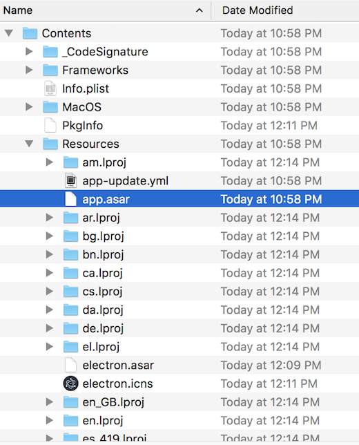
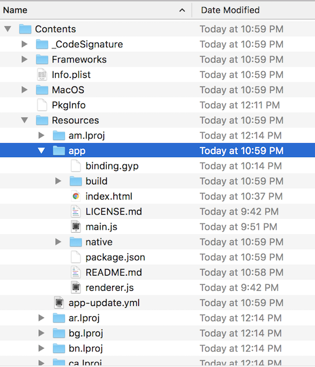
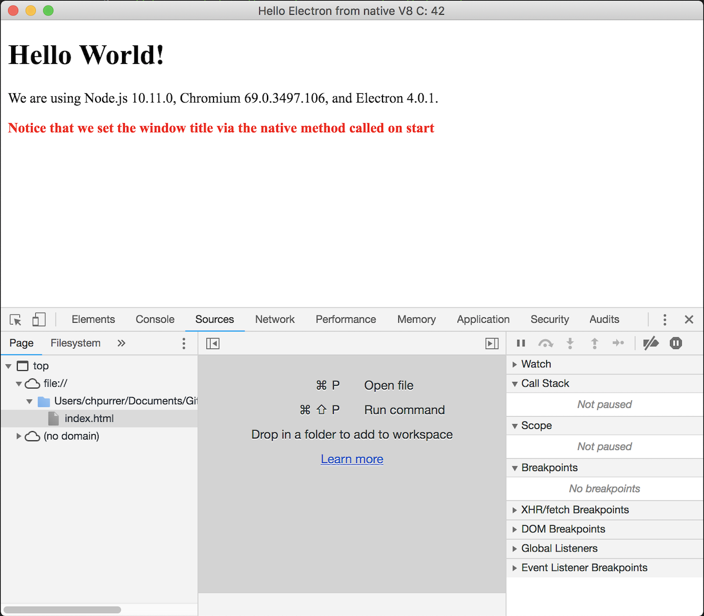
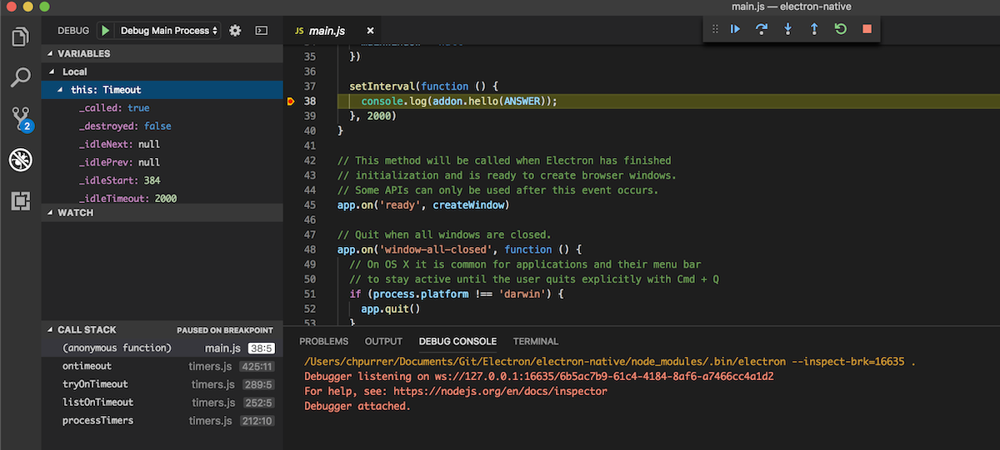
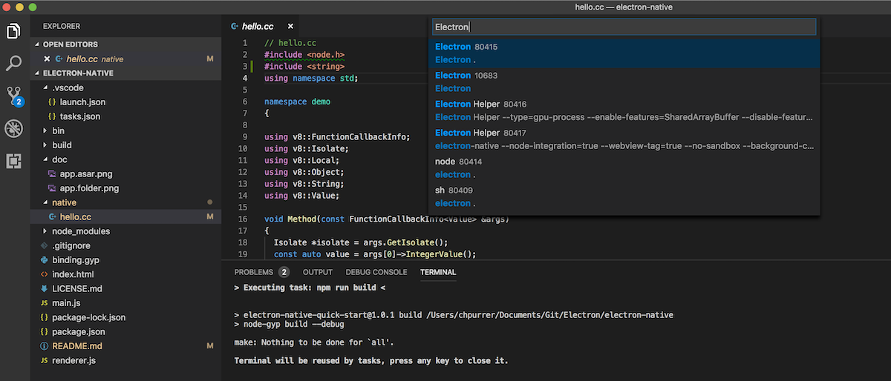
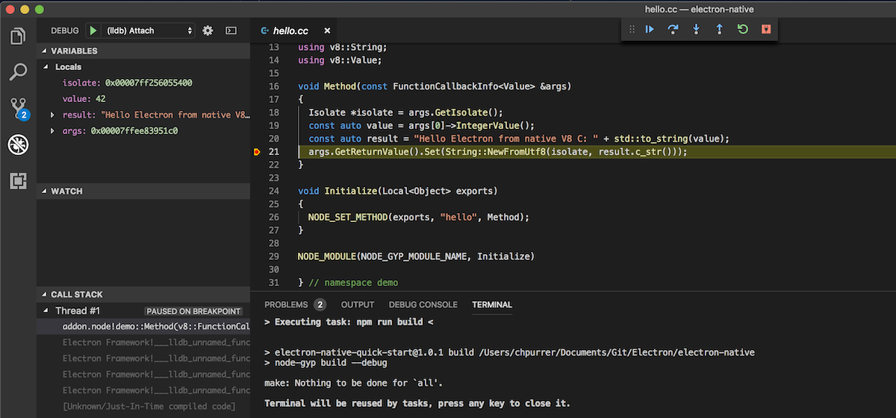

# electron-native

This is a super simple Electron example, demonstrating how to package a native C component into an Electron app.
Based on: [https://github.com/electron/electron-quick-start](https://github.com/electron/electron-quick-start)

## Start

To clone and run this repository you'll need [Git](https://git-scm.com), [Node.js](https://nodejs.org/en/download/) (which comes with [npm](http://npmjs.com)) installed on your computer. 

From your command line:

```bash
# Clone this repository
git clone https://github.com/christophpurrer/electron-native.git
# Go into the repository
cd electron-native
# Install dependencies
npm install
# Run the app
npm start
```
This will run the application.

## Package

The app integrates the Electron app packager: [electron-builder](https://www.electron.build):

```bash
# Package
npm run dist
npm run dist-win
```

The crucial setting to packaging of native components work with electron-builder is:

```bash
  "build": {
    "files": [
      "**/*",
      "build/**/*"
    ]
  },
```
otherwise the native components are NOT included in the final package.

Contrary to [electron-packager](https://github.com/electron-userland/electron-packager) an [app.asar](https://electronjs.org/docs/tutorial/application-packaging) file is created by default by [electron-build](https://www.electron.build).



Disable it in the build block in package.json for further investigation in case things don't work as expected.

```bash
  "build": {
    "asar": false
  },
```



## Debugging
Here is a [good article](https://medium.com/@atulanand94/debugging-nodejs-c-addons-using-vs-code-27e9940fc3ad) to debug a native addon with VSCode.

You are interested in 3 kinds of debugging scenarios:
1.) Chromium Render process. 
Use Chrome Developers tools.


2.) Node.js main process. 
Launch app from [VSCode](https://code.visualstudio.com/) using the 'Debug Main Process' debug configuration.


3.) Native C/C++ code. 
Launch app from the command line: npm start. 
Launch/attach the Native C/C++ debugger from [VSCode](https://code.visualstudio.com/) using the '(lldb) Attach' debug configuration.




## Resources
The hello.cc sample is based on [Node.js C++ Addons](https://nodejs.org/api/addons.html) documentation.

## License

[CC0 1.0 (Public Domain)](LICENSE.md)
